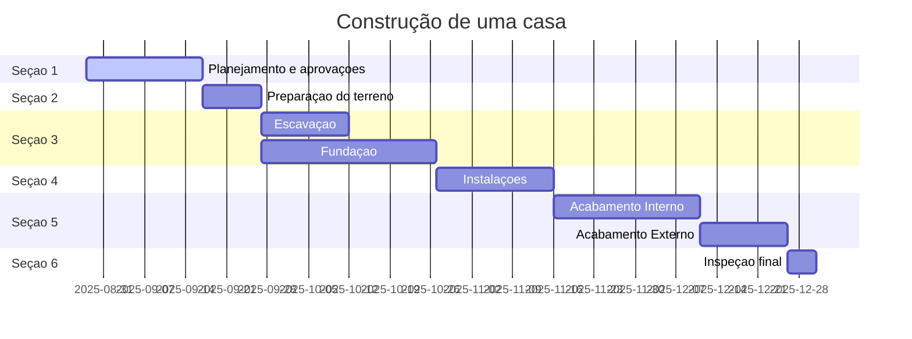
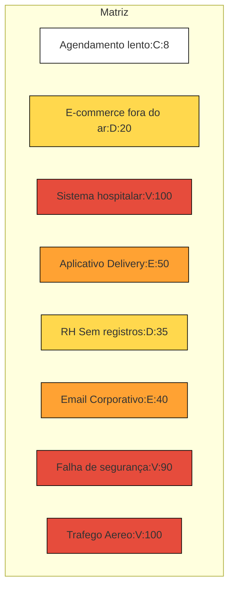

# Construcao-de-uma-casa



#Crystal



#Atividade 2
```mermaid
gantt
title Sistema de Cadastro de Empresas Parceiras
dateFormat YYYY-MM-DD
section Inicio do Projeto
Configuração do Ambiente de Desenvolvimento: crit, a1, 2025-02-01, 15d
Criação do Banco de Dados: crit, a2, after a1, 15d
Programação do Módulo de Login: crit, a3, after a2, 20d
Programação do CRUD de Empresas: crit, a4, after a3, 20d
Implementação do Upload de Logotipo: crit, a5, after a4, 20d
Desenvolvimento dos Relatórios: crit, a6, after a5, 15d
Configuração do Painel Administrativo: crit, a7, after a6, 20d
Testes Unitários e de Integração: crit, a8, after a7, 15d
section Final do Projeto
Testes de Usabilidade com Usuários Convidados: crit, a9, after a8, 15d
Implementação Final no Servidor e Entrega ao Cliente: a10, after a9, 20d

end
```
