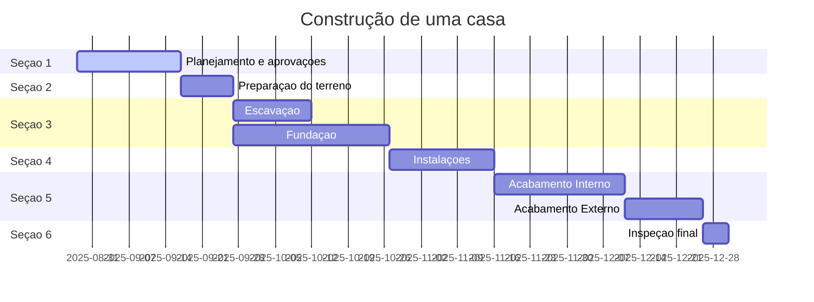
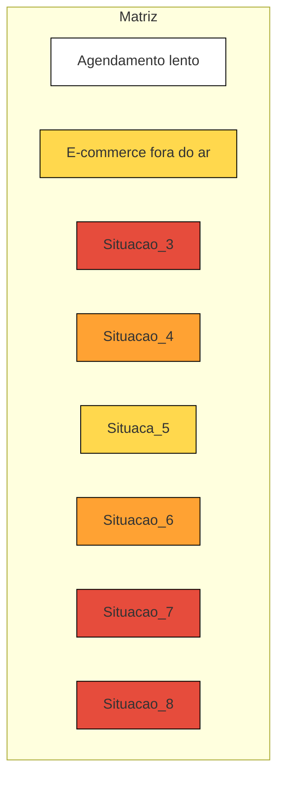

# Construcao-de-uma-casa

```mermaid
gantt
  title Construção de uma casa
dateFormat YYYY-MM-DD
section Seçao 1
Planejamento e aprovaçoes:active, a1, 2025-08-28, 20d
section Seçao 2
Preparaçao do terreno:a2, after a1, 10d
section Seçao 3
Escavaçao:a3, after a2, 15d
Fundaçao:a4, after a2, 30d
section Seçao 4
 Instalaçoes:a5, after a4, 20d
section Seçao 5
Acabamento Interno:a6,after a5, 25d
Acabamento Externo:a7, after a6, 15d
section Seçao 6
Inspeçao final:a8, after a7, 5d
```

#Crystal

```mermaid
graph TD
  subgraph Matriz
    A1["Agendamento lento"]:::branco
    B2["E-commerce fora do ar"]:::amarelo
    C4["Situacao_3"]:::vermelho
    D3["Situacao_4"]:::laranja
    E2["Situaca_5"]:::amarelo
    F3["Situacao_6"]:::laranja
    G4["Situacao_7"]:::vermelho
    H4["Situacao_8"]:::vermelho
end

classDef branco fill:#fff,      stroke:#000,  stroke-width:1px;
classDef amarelo fill:#FFD84D,  stroke:#000,  stroke-width:1px;
classDef laranja fill:#FFA233,  stroke:#000,  stroke-width:1px;
classDef vermelho fill:#E64C3C, stroke:#000,  stroke-width:1px;

```
