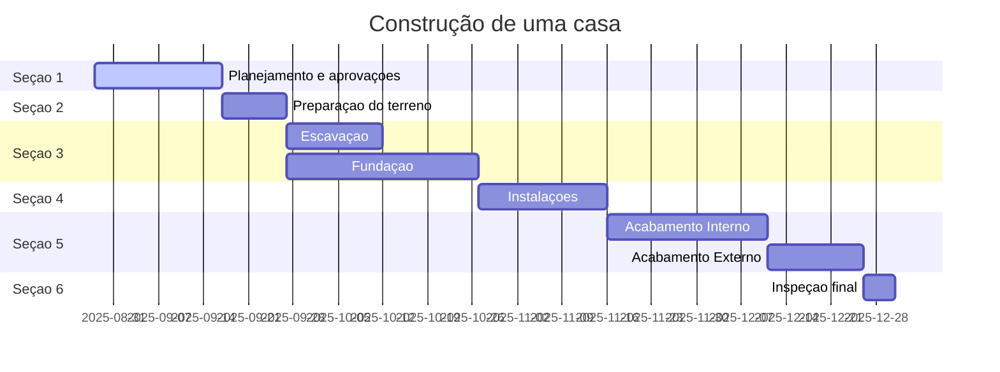
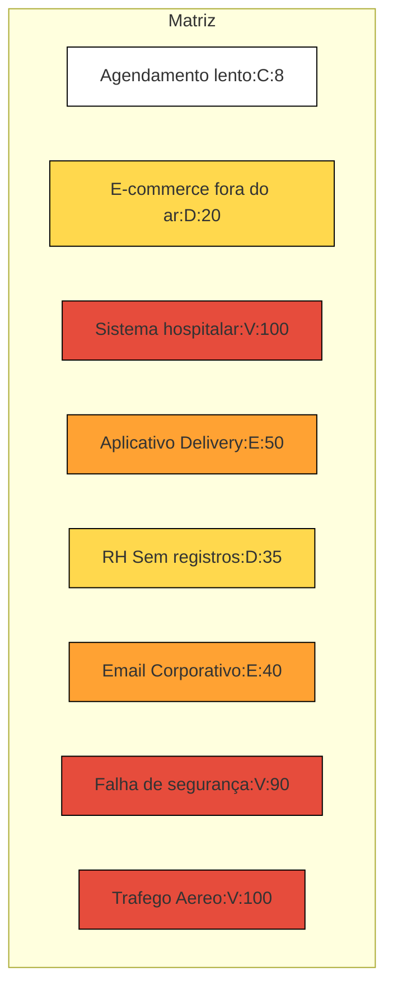
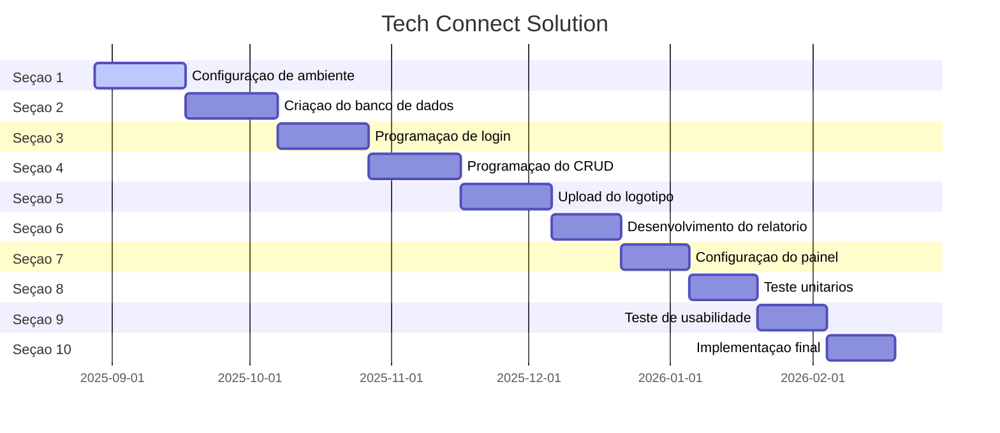

# Construcao-de-uma-casa

```mermaid
gantt
  title Construção de uma casa
dateFormat YYYY-MM-DD
section Seçao 1
Planejamento e aprovaçoes:active, a1, 2025-08-28, 20d
section Seçao 2
Preparaçao do terreno:a2, after a1, 10d
section Seçao 3
Escavaçao:a3, after a2, 15d
Fundaçao:a4, after a2, 30d
section Seçao 4
 Instalaçoes:a5, after a4, 20d
section Seçao 5
Acabamento Interno:a6,after a5, 25d
Acabamento Externo:a7, after a6, 15d
section Seçao 6
Inspeçao final:a8, after a7, 5d
```

#Crystal

```mermaid
graph TD
  subgraph Matriz
    A1["Agendamento lento:C:8"]:::branco
    B2["E-commerce fora do ar:D:20"]:::amarelo
    C4["Sistema hospitalar:V:100"]:::vermelho
    D3["Aplicativo Delivery:E:50"]:::laranja
    E2["RH Sem registros:D:35"]:::amarelo
    F3["Email Corporativo:E:40"]:::laranja
    G4["Falha de segurança:V:90"]:::vermelho
    H4["Trafego Aereo:V:100"]:::vermelho
end

classDef branco fill:#fff,      stroke:#000,  stroke-width:1px;
classDef amarelo fill:#FFD84D,  stroke:#000,  stroke-width:1px;
classDef laranja fill:#FFA233,  stroke:#000,  stroke-width:1px;
classDef vermelho fill:#E64C3C, stroke:#000,  stroke-width:1px;

```

#Atividade 2 Gant//Crystal

```mermaid
gantt
  title Tech Connect Solution
dateFormat YYYY-MM-DD
section Seçao 1
Configuraçao de ambiente:active, a1, 2025-08-28, 20d
section Seçao 2
Criaçao do banco de dados:a2, after a1, 20d
section Seçao 3
Programaçao de login:a3, after a2, 20d
section Seçao 4
 Programaçao do CRUD:a4, after a3, 20d
section Seçao 5
Upload do logotipo:a5,after a4, 20d
section Seçao 6
Desenvolvimento do relatorio:a6, after a5, 15d
section Seçao 7
Configuraçao do painel:a7, after a6, 15d
section Seçao 8
Teste unitarios:a8, after a7, 15d
section Seçao 9
Teste de usabilidade:a9, after a8, 15d
section Seçao 10
Implementaçao final:a10, after a9, 15d
```

```mermaid
graph TD
  subgraph Matriz
    A1["Agendamento lento:C:8"]:::branco
    B2["E-commerce fora do ar:D:20"]:::amarelo
    C4["Sistema hospitalar:V:100"]:::vermelho
    D3["Aplicativo Delivery:E:50"]:::laranja
    E2["RH Sem registros:D:35"]:::amarelo
    F3["Email Corporativo:E:40"]:::laranja
    G4["Falha de segurança:V:90"]:::vermelho
    H4["Trafego Aereo:V:100"]:::vermelho
end

classDef branco fill:#fff,      stroke:#000,  stroke-width:1px;
classDef amarelo fill:#FFD84D,  stroke:#000,  stroke-width:1px;
classDef laranja fill:#FFA233,  stroke:#000,  stroke-width:1px;
classDef vermelho fill:#E64C3C, stroke:#000,  stroke-width:1px;

```
